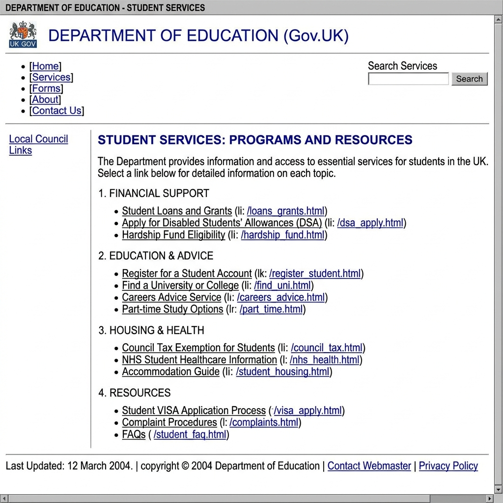
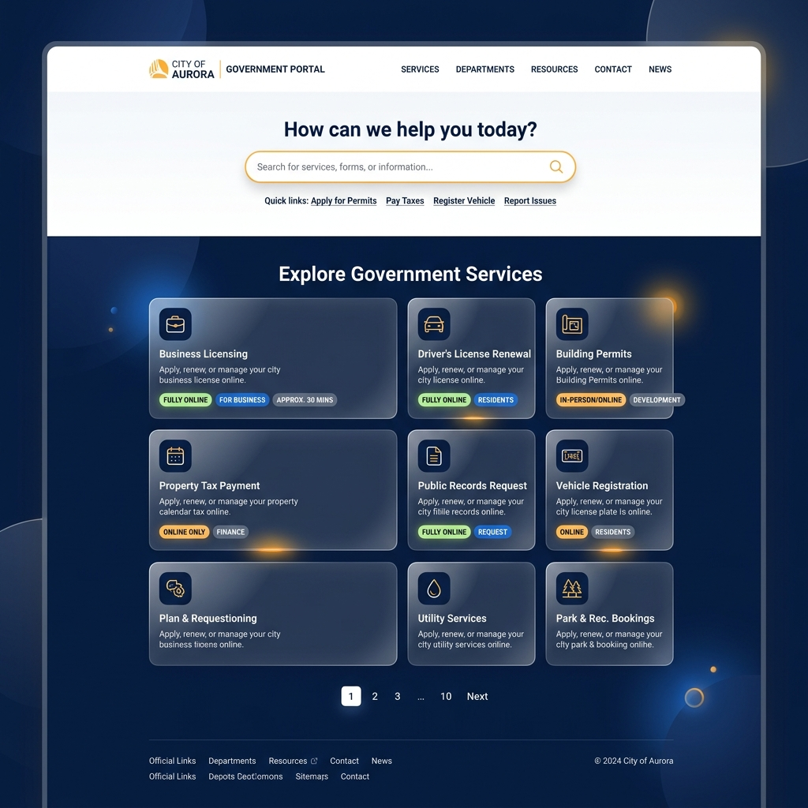

# Website-UI-redesign

Redesigning of the [National Government Services Portal - Students Category](https://services.india.gov.in/service/listing?cat_id=41&ln=en) page to provide a modern, premium, and highly interactive user experience.

## Live Links
- **Original Website (Old Design)**: [India Gov Services Portal](https://services.india.gov.in/service/listing?cat_id=41&ln=en)
- **Redesigned Website (New Design)**: [View New UI Design](https://dev-patel-wiz27.github.io/Website-UI-redesign/) *(Hosted via GitHub Pages)*

## Project Overview

This project focuses on transforming a functional but dated government portal into a state-of-the-art interface. The redesign utilizes **Vanilla HTML, CSS, and JS**, incorporating modern design principles such as:
- **Glassmorphism**: Soft, translucent backgrounds with blur effects.
- **Premium Aesthetics**: A color palette utilizing Deep Navy Blue, crisp whites, and Saffron accents.
- **Dynamic Interactions**: Smooth hover states, micro-animations, and interactive badges.
- **Responsive Layout**: Fully adaptive layout for desktop, tablet, and mobile devices using CSS Grid and Flexbox.
- **Accessibility**: Includes built-in controls for font-size adjustments.

## UI Design Comparison

### Old UI Design
The original design was functional but lacked modern visual hierarchy and interactive elements.

### New UI Design
The new design focuses on a clean layout, clear typography (using Google's *Outfit* font), and an improved user experience with better categorization and search prominence.

## Features

- **Semantic HTML5 Structure**
- **No Build Tools Required**: Built purely with HTML/CSS/JS.
- **Phosphor Icons**: High-quality, scalable vector icons.
- **Interactive Service Cards**: Highlighted tags for "Fully Online" or "Registration Required".

## How to Run

Since this project uses vanilla web technologies, there is no need to run `npm install`.
1. Clone this repository.
2. Open `index.html` in your web browser to view the redesigned UI.
